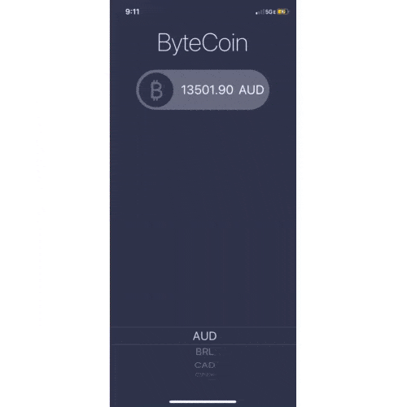

# ByteCoin
This app was created as a part of a [Udemy course](https://www.udemy.com/share/101WsWAEMScldUQn8F/) I am taking (April 2020). 

The goal here was to keep working with making HTTP requests and JSON parsing. Using [CoinAPI.io](https://www.coinapi.io/), the user can get the current Bitcoin prices in many common currencies.

## Lesson Objectives

* Learn about the delegate pattern.
* Swift protocols and extensions. 
* Learn to use URLSession to network and make HTTP requests.
* Parse JSON with the native Encodable and Decodable protocols. 
* Learn to use Grand Central Dispatch to fetch the main thread.
>This is a companion project to The App Brewery's Complete App Development Bootcamp, check out the full course at [www.appbrewery.co](https://www.appbrewery.co/)

## Final Result

